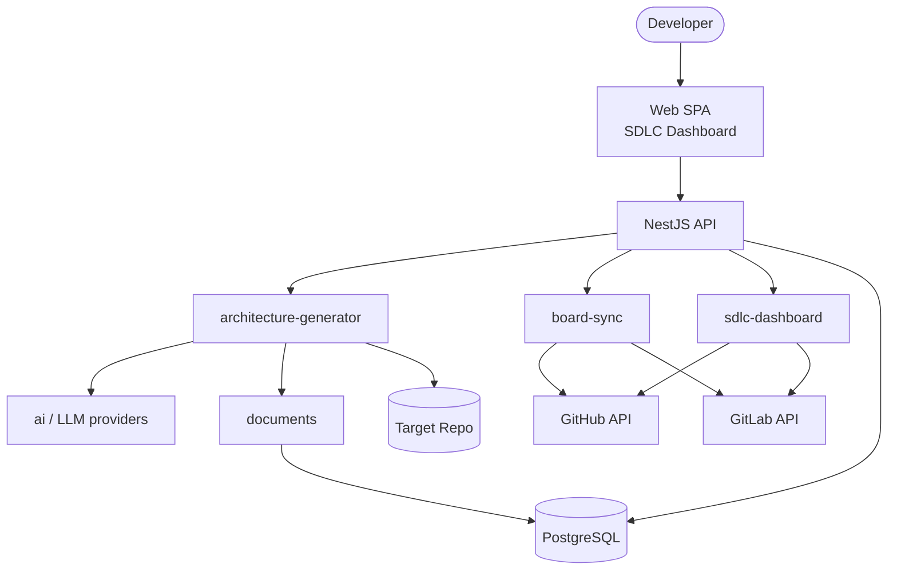

# Architecture v2 — Idea-to-Repo & SDLC Orchestrator

This document describes the technical architecture after the strategic refocus (see [ADR-004](adr/ADR-004-IDEA-TO-REPO-ORCHESTRATOR.md)).

Dev-Companion orchestrates the SDLC for greenfield projects. It does not generate or edit application source code.

## System context



## Three core phases

### 1. Architecture Generator (`packages/architecture-generator`)

**Input:** Vague idea (text), optional constraints.

**Output:** `README.md`, `spec.md`, `docs/adr/ADR-*.md` committed to the linked repository.

**Flow:**

```text
Idea text
  → LLM prompt chain (via @dev-companion/ai)
    → Structured ProjectSpec + AdrDraft[]
      → RepoSeedingService.buildArtifacts()
        → Git push (GitHub/GitLab API)
```

**Key interfaces:**

| Interface | Responsibility |
| --- | --- |
| `AdrGenerationService` | LLM prompt chains for spec + ADRs |
| `RepoSeedingService` | Build file tree and push to target repo |
| `LlmProvider` (in `packages/ai`) | OpenAI, Anthropic, Ollama adapters |

### 2. Board Sync (`packages/board-sync`)

**Input:** `ProjectSpec`, `ADR[]`, epic definitions.

**Output:** Milestones, epics (parent issues), issues with acceptance criteria and subtasks on GitHub or GitLab.

**Flow:**

```text
ProjectSpec + ADRs
  → Epic/story decomposition (LLM-assisted or rule-based)
    → BoardProviderAdapter.createMilestone()
    → BoardProviderAdapter.createIssue() (epic → stories → tasks)
      → Board linked to target repo
```

**Key interfaces:**

| Interface | Responsibility |
| --- | --- |
| `BoardProviderAdapter` | GitHub/GitLab REST/GraphQL abstraction |
| `BoardSyncService` | Orchestrate seeding and progress sync |
| `GitHubBoardAdapter` | GitHub Issues + Milestones |
| `GitLabBoardAdapter` | GitLab Issues + Milestones |

### 3. SDLC Dashboard (`packages/sdlc-dashboard`)

**Input:** Linked repo + board state, pull requests, accepted ADRs.

**Output:** Progress metrics, ADR compliance reports, deployment guides.

**Flow:**

```text
Board + Repo state
  → SdlcTrackingService.refreshFromBoard()
    → ProjectProgress (milestones, issues, ADR counts)

Pull request opened
  → AdrComplianceChecker.check(diff, accepted ADRs)
    → AdrComplianceResult (violations surfaced in dashboard)

Coding complete
  → DeploymentGuideGenerator.generate(spec, adrs, stack)
    → DeploymentGuide (markdown artifact)
```

**Key interfaces:**

| Interface | Responsibility |
| --- | --- |
| `SdlcTrackingService` | Aggregate progress across board and repo |
| `AdrComplianceChecker` | Verify PRs against accepted ADRs |
| `DeploymentGuideGenerator` | Post-coding deployment documentation |

## Data models (`packages/shared`)

| Model | Purpose |
| --- | --- |
| `ProjectSpec` | Structured specification from idea seeding |
| `ADR` | Architecture Decision Record |
| `Milestone` | Board milestone (SDLC phase) |
| `BoardIssue` / `GitHubIssue` | Epic, story, or task on a board |
| `Epic` | Grouping of stories under a milestone |
| `DeploymentGuide` | Post-coding deployment instructions |
| `ProjectProgress` | Dashboard aggregate metrics |
| `AdrComplianceResult` | PR check outcome |

## Application boundaries

### Web (`apps/web`)

- Idea input wizard
- SDLC progress dashboard
- ADR compliance reports
- Deployment guide viewer
- Project and board linking (OAuth)

### API (`apps/api`)

- Orchestrates the three core packages
- Auth, project CRUD, webhook handlers (PR events)
- Does not touch application source code in target repos

### Infrastructure packages

| Package | Role |
| --- | --- |
| `ai` | LLM provider adapters (OpenAI, Ollama, Anthropic) |
| `documents` | Versioned artifact persistence |
| `database` | Drizzle schema, migrations |
| `auth` | Better Auth (SaaS) / local auth (on-prem) |
| `validation` | Structured LLM response validation |

## Deployment topologies

### Cloud SaaS

```text
Render / AWS
  ├── web (static SPA)
  ├── api (NestJS)
  ├── PostgreSQL (managed)
  └── GitHub App (OAuth + webhooks)
```

### On-Premise Docker

```text
docker-compose
  ├── web
  ├── api
  ├── postgres
  └── ollama (optional local LLM)
```

Environment variable `LLM_PROVIDER` selects the active adapter. `BOARD_PROVIDER` selects GitHub or GitLab.

## Dependency rule

```text
apps
  ↓
architecture-generator | board-sync | sdlc-dashboard
  ↓
shared (models) + ai + documents
  ↓
interfaces (BoardProviderAdapter, LlmProvider)
  ↓
adapters (GitHub, GitLab, OpenAI, Ollama)
  ↓
external APIs
```

Domain packages never import concrete adapter implementations directly — wiring happens in `apps/api`.

## Out of scope (removed)

The following are explicitly **not** part of v2:

- Inline code completion or autocompletion
- File-level refactoring or code editing
- Task-level implementation guidance during coding
- Code review assistance on diffs (beyond ADR compliance checks)

See [ADR-004](adr/ADR-004-IDEA-TO-REPO-ORCHESTRATOR.md).
