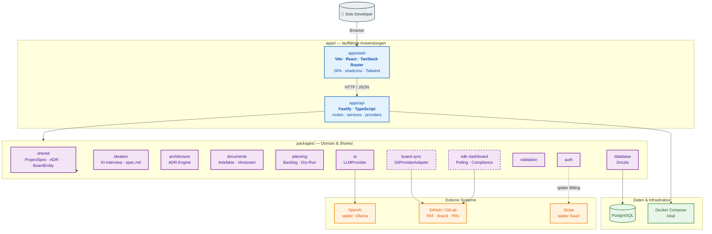
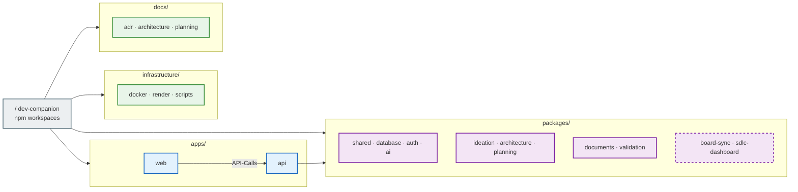
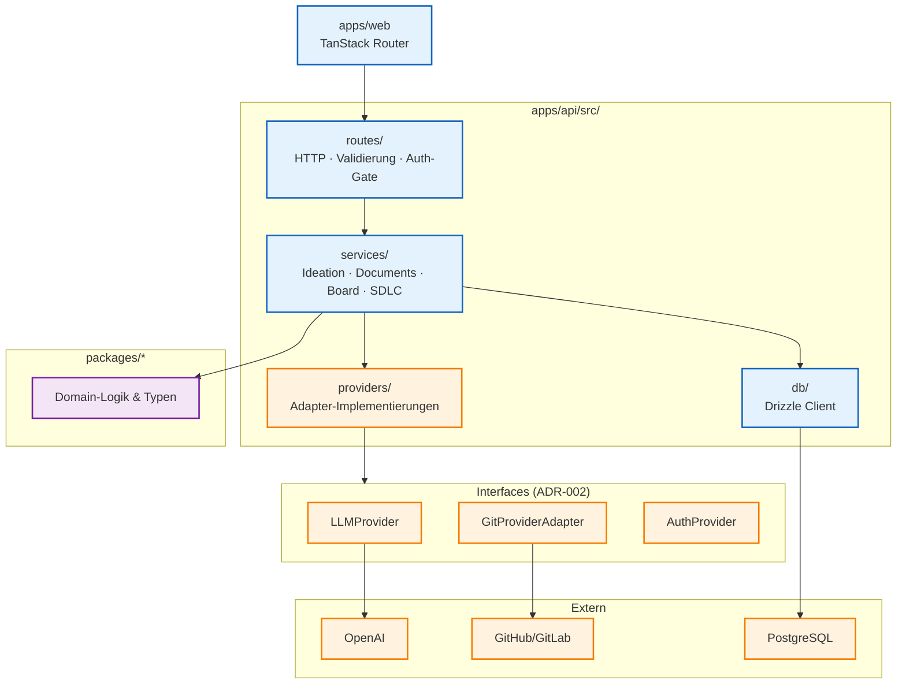
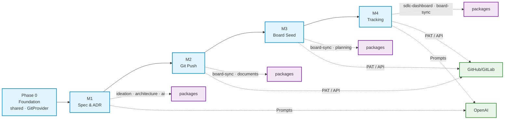
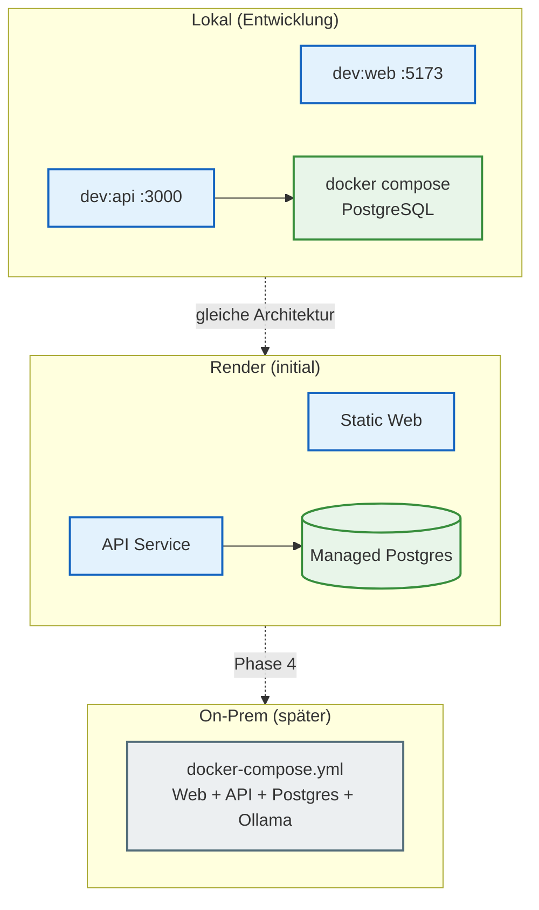

# Architecture Diagram

Übersicht der Struktur und Architektur von Dev-Companion. Ergänzt [overview.md](overview.md), [monorepo.md](monorepo.md) und die [User Journey](../planning/user-journey.md).

**Legende:** durchgezogen = im Repo / entschieden · gestrichelt = geplant (noch nicht umgesetzt)

---

## 1. Gesamtarchitektur (System)

---

## 2. Monorepo-Struktur

---

## 3. API-Schichten (Fastify)

Ziel-Layout nach [ADR-004](../adr/ADR-004-FASTIFY-API.md). Nest-Scaffold in `apps/api` wird bei AP 1.2b (clean Fastify scaffold) ersetzt — kein Portieren von Nest-Code.

**Abhängigkeitsregel:** Domain → Interface → Adapter → externes System. Kein `packages/ideation` importiert direkt `@octokit/rest`.

---

## 4. Produktfluss × Architektur (MVP)

Verknüpfung von [User Journey](../planning/user-journey.md) und Modulen.

---

## 5. Deployment (einfach)

---

## Weitere Ansichten

| Thema | Dokument |
| --- | --- |
| User Journey (detailliert) | [user-journey.md](../planning/user-journey.md) |
| MVP-Phasen M1–M4 | [product-direction.md](../planning/product-direction.md) |
| Domain-Module | [domain-modules.md](domain-modules.md) |
| Geplante Code-Änderungen | [HINWEIS.md](HINWEIS.md) |
