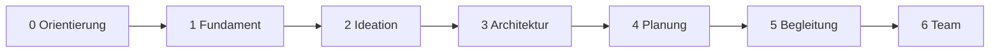

# Phasenplan

Arbeitsplan zum Folgen. Die [Roadmap](roadmap.md) ist die Produktsicht; dieses Dokument ist die **Reihenfolge der Arbeit**. Ein Arbeitspaket nach dem anderen. Code nur nach expliziter Freigabe (`code`, `execute`, `umsetzen`, `make it so`).

**Aktuell:** Phase 0, AP 1.1 und AP 1.2 sind erledigt. Als Nächstes **AP 1.3**.



```text
Orientierung → Fundament → Ideation → Architektur → Planung → Begleitung → Team
     done       in Arbeit
```

Progress (Konsistenz anerkennen, kleine Beiträge zählen, kein Volumen-Score) ist **kein spätes Extra**. Es beginnt sichtbar im Dashboard (Phase 1) und wird mit jeder Phase reicher — nie als Streak-Druck.

---

## Phase 0 — Orientierung

**Status:** erledigt.

### Warum

Ohne Motivation, Linie und Docs wäre der erste Code wieder ein leeres Repo. Genau das soll Dev-Companion verhindern — zuerst bei uns selbst.

### Was

Produktname Dev-Companion, Motivation (Linie + Konsistenz), Companion-first, npm Workspaces, schlanke Doc-Struktur unter `docs/`, GitHub angebunden.

### Wie

Diskussion, dann Docs. Kein Produktcode.

### Arbeitspakete

| ID | Paket | Fertig wenn |
| --- | --- | --- |
| AP 0.1 | Motivation und Plan | `project-plan.md` trägt die echte Motivation |
| AP 0.2 | Doc-Struktur | Root nur README, AGENTS, CONTRIBUTING; Rest unter `docs/` |
| AP 0.3 | Arbeitsmodus Agent | Companion-first, Commit-Message-Konvention |
| AP 0.4 | Name und Stack-Entscheidungen | Dev-Companion, npm, ADRs 001/002/003 |

---

## Phase 1 — Fundament

**Status:** in Arbeit (2 / 8 Pakete erledigt).

### Warum

Die Linie muss **betretbar** sein: einloggen, Projekt anlegen, Dashboard sehen, merken dass ein kleiner Schritt zählt. Ohne dieses Fundament sind Ideation und KI nur Chat ohne Ort.

### Was

Laufendes lokales System: Monorepo (Vite/TanStack Router + NestJS), Docker (PostgreSQL), Auth, Projekte mit Besitz, Dokumentenspeicher (noch ohne Wizard), Dashboard mit leichtem Progress-Hinweis. CI, das zumindest installiert und typecheckt.

### Wie

Zuerst Grenzen und Datenmodell in Docs schärfen, dann Arbeitspaketweise umsetzen. Auth und DB hinter Interfaces (ADR-002). Progress in Phase 1 nur: „du warst da / du hast etwas festgehalten“ — keine Punkte, keine Leaderboards.

### Arbeitspakete

| ID | Paket | Was | Wie | Fertig wenn |
| --- | --- | --- | --- | --- |
| AP 1.1 | Monorepo | `apps/web`, `apps/api`, `packages/*` als npm Workspaces | Scaffold passend zu `docs/architecture/monorepo.md` | `npm install` im Root, beide Apps starten leer aber gültig |
| AP 1.2 | Lokal-Infra | PostgreSQL per Docker Compose | Compose unter `infrastructure/` bzw. Root, wie in `docs/development.md`. Kein Redis, solange es keine Worker/Jobs gibt. | `docker compose up` reicht für lokale Postgres |
| AP 1.3 | Datenbank | Drizzle-Schema, Migrationen, Zugriff in `packages/database` | Schema klein halten: User, Session, Project, Document | Migration läuft gegen Compose-Postgres |
| AP 1.4 | Auth | Registrierung, Login, Session, Projektbesitz | Better Auth hinter Auth-Grenze | Nutzer kann Konto anlegen und bleibt eingeloggt |
| AP 1.5 | Projekte | Anlegen, bearbeiten, besitzen, Status | Domain `projects`, API + einfache UI | Ein User hat mindestens ein eigenes Projekt |
| AP 1.6 | Dokumentenkern | Persistente, versionierbare Artefakte | Domain `documents` ohne Wizard; Speichern/Lesen/Version | Ein Dokument kann angelegt und versioniert werden |
| AP 1.7 | Dashboard | Projektübersicht, Status, erster Konsistenz-Hinweis | Web-Shell (Tailwind, shadcn), Ton ermutigend, nicht wertend | Nach einer kleinen Änderung sieht der User Anerkennung, nicht eine Punktzahl |
| AP 1.8 | Qualität | Lint, Typecheck, erste Tests, GitHub Actions | Gates aus `docs/development.md` | CI läuft auf `main` |

**Nicht in Phase 1:** LLM-Aufrufe, Ideation-Wizard, Team, Deployment auf Render (lokal reicht).

### Hinweise zu AP 1.3 (jetzt)

Issue: [#3 AP 1.3 — Datenbank](https://github.com/ktauchert/dev-companion/issues/3). Branch wenn umgesetzt wird: `ap-1-3-datenbank`.

**Fertig-wenn bleibt:** eine Drizzle-Migration läuft gegen die Compose-Postgres. Nicht: Login, Projekt-CRUD, Dokument-Versionen, Dashboard, CI.

**Schon da:** leere Hülle `packages/database` (nur `package.json`). Postgres per Compose aus AP 1.2. Nest und Vite starten, ohne DB.

**In diesem Paket**

- Drizzle in `packages/database`: Schema, Client, `drizzle-kit`, erste Migration.
- Tabellen klein: User, Session, Project, Document.
- `apps/api` darf den Client nur als Verbindung nutzen (Nest-Modul / `DATABASE_URL`). Keine Domain-APIs.
- `.env.example` an Compose angleichen (`DATABASE_URL` für die App, `POSTGRES_*` für Compose).

**Nicht in diesem Paket**

- Better Auth verdrahten (AP 1.4).
- Projekte anlegen/bearbeiten (AP 1.5).
- Dokument-Historie / Wizard (AP 1.6).
- Domain-Logik in `packages/database` — das Package ist Infrastruktur, nicht die Projects-/Documents-Domain.

**Vor dem Coden klären:** User/Session nicht frei erfinden. Better Auth (AP 1.4) erwartet eigene Tabellen (`user`, `session`, plus in der Praxis `account` und `verification`). Entweder diese Tabellen jetzt aus dem Better-Auth-Schema übernehmen, ohne die Library zu verdrahten — oder User/Session auf AP 1.4 verschieben und in 1.3 nur Project/Document (mit `owner_id` als Text/UUID). Eigenes User-Modell jetzt heißt in 1.4 umbauen.

Document in 1.3 = aktuelle Zeile (Projekt, Titel/Typ, Inhalt, Zeitstempel). Versionstabelle erst in AP 1.6.

**AP 1.2-Rest, sonst verbindet migrate nicht:** Compose setzt `POSTGRES_PASSWORT` (Postgres liest `POSTGRES_PASSWORD`). Port-Mapping ist `5454:5454` (Container lauscht auf 5432). `.env.example` hat Platzhalter und `POSTGRES_URL` auf `localhost:5432`. Das am Anfang von 1.3 richten, nicht als neues Arbeitspaket.

**Wenn umgesetzt wird (Reihenfolge)**

1. Compose/Env so, dass ein Client wirklich verbindet (Passwort-Var, Host-Port → 5432 im Container, `DATABASE_URL`).
2. Drizzle-Abhängigkeiten und Config in `packages/database`.
3. Minimales Schema, Migration erzeugen, gegen Compose anwenden.
4. Client exportieren; Nest hängt ihn an `DATABASE_URL`. Optional: Health-Ping — nicht nötig für Fertig-wenn.

---

## Phase 2 — Ideation

### Warum

Solo-Devs starten im Kopf. Der Wizard macht daraus die **erste dokumentierte Linie**: Problem, Nutzer, Nutzen, Ziele, Risiken, Grenzen. Ohne persistente Artefakte bleibt Ideation ein Gespräch.

### Was

Geführter Ideation-Flow pro Projekt. KI darf zusammenfassen, schärfen, Lücken zeigen — Vorschläge, keine Wahrheit. Ergebnis: versionierte Einstiegsdokumente.

### Wie

Wizard schreibt nur über die Documents-Domain. KI hinter `LLMProvider` (zuerst OpenAI). Jede KI-Ausgabe validieren, bevor sie persistiert wird. Fortschritt: auch ein gespeicherter Wizard-Schritt zählt.

### Arbeitspakete

| ID | Paket | Was | Fertig wenn |
| --- | --- | --- | --- |
| AP 2.1 | Wizard-Schritte | Problem, Zielgruppe, Value, Ziele, Risiken, Constraints | Nutzer kann den Flow durchlaufen und unterbrechen |
| AP 2.2 | Artefakte aus Ideation | Vision / Kurzprofil als versioniertes Dokument | Abschluss erzeugt persistente Docs, editierbar |
| AP 2.3 | KI-Provider | Interface + OpenAI-Adapter, strukturierte Antworten | Analyse läuft gegen das Interface, nicht gegen SDK-Calls in der Domain |
| AP 2.4 | KI-Hilfe Ideation | Summary, Scope, Reife, Empfehlungen | Vorschläge sichtbar; Übernehmen ist eine bewusste User-Aktion |
| AP 2.5 | Progress | Kleine Wizard-/Doc-Schritte anerkennen | Feedback ohne Mengen-Score |

---

## Phase 3 — Architektur

### Warum

Entscheidungen, die nur im Chat leben, sind beim nächsten Projekt weg. Architektur und ADRs sind die Linie für Stack, Schnittstellen und Kompromisse.

### Was

Pro Projekt: Stack-Vorschlag, grobe Architektur, Datenmodell-Skizze, Architektur-Dokument, ADRs mit Historie. KI darf entwerfen, der User entscheidet.

### Wie

Eigene Architecture-Domain; ADRs sind Dokumente mit Status (Proposed / Accepted / …). Nichts erzwingen — Default-Pfad anbieten. Bestehende Projekt-ADRs (001, 002) sind das Muster, nicht der Inhalt fremder Projekte.

### Arbeitspakete

| ID | Paket | Was | Fertig wenn |
| --- | --- | --- | --- |
| AP 3.1 | Stack-Empfehlung | Frontend, Backend, DB, Infra, Hosting als Vorschlag | Nutzer kann übernehmen, anpassen oder ablehnen |
| AP 3.2 | Architektur-Doku | Überblick, Komponenten, Datenmodell | Versioniertes Architektur-Artefakt existiert |
| AP 3.3 | ADRs | Anlegen, Status, Historie, optional KI-Entwurf | Entscheidung ist nachvollziehbar ohne den Chat |
| AP 3.4 | Progress | Anerkennung für festgehaltene Entscheidungen | Eine ADR zählt — unabhängig von Länge |

---

## Phase 4 — Planung

### Warum

Ohne Schnitt zwischen Vision und nächstem Schritt entsteht wieder Hero-Arbeit. Planung zerlegt die Linie in Pakete, die konsistent klein bleiben dürfen.

### Was

Backlog: Epics, Features, Stories, Tasks. Grobe Priorität (MVP / danach / später). Reihenfolge und Abhängigkeiten. Keine Scheingenauigkeit bei Schätzungen.

### Wie

Planning-Domain liest vorhandene Artefakte (Ideation, Architektur), schreibt Pläne als Dokumente. KI darf schneiden und sortieren; der User priorisiert.

### Arbeitspakete

| ID | Paket | Was | Fertig wenn |
| --- | --- | --- | --- |
| AP 4.1 | Backlog-Modell | Epics → Features → Stories → Tasks | Hierarchie ist persistent und am Projekt hängend |
| AP 4.2 | Priorisierung | MVP / Post-MVP / später | Nutzer kann umsortieren ohne Neu-Generierung |
| AP 4.3 | Reihenfolge | Abhängigkeiten, sinnvolle Umsetzungsreihenfolge | Nächstes Arbeitspaket ist sichtbar |
| AP 4.4 | Progress | Haken an kleinen Tasks ist Konsistenz, nicht Velocity | Keine Story-Points als Wertung der Person |

---

## Phase 5 — Begleitung in der Umsetzung

### Warum

Die Linie darf nach dem Plan nicht abreißen. In der Umsetzung braucht der Solo-Dev Erinnerung an Qualität, Tests, Bereitschaft — und weiter Anerkennung fürs Weitermachen.

### Was

Begleitung am aktuellen Task: Hinweise zu Tests, Review, Checklisten, Deployment-Bereitschaft, sichtbare technische Schulden. Deployment-Domain: Checklisten und Pläne, noch nicht zwingend ein Klick-Deploy.

### Wie

Lesen aus Backlog + Docs; schreiben von Checklisten und Schuld-Notizen als Artefakte. KI assistiert am Diff oder am Task, ersetzt kein Review. Render o. Ä. erst, wenn lokal und CI stehen.

### Arbeitspakete

| ID | Paket | Was | Fertig wenn |
| --- | --- | --- | --- |
| AP 5.1 | Task-Begleitung | Guidance, Testvorschläge, PR-/Done-Checkliste | Am offenen Task ist der nächste Qualitäts-Schritt klar |
| AP 5.2 | Schulden | Festhalten und Wiederfinden technischer Schulden | Schulden sind Artefakte, nicht nur Bauchgefühl |
| AP 5.3 | Deployment-Bereitschaft | Checklisten, Hosting-Empfehlung, Plan | Vor dem ersten echten Deploy gibt es eine Liste, kein Rätsel |
| AP 5.4 | Progress | Auch Tests, Docs, kleine Fixes zählen | Umsetzung misst nicht nur „Feature fertig“ |

---

## Phase 6 — Team

### Warum

Zweitnutzer und kleine Teams brauchen dieselbe Linie, geteilt — ohne aus dem Solo-Produkt ein Enterprise-IAM zu machen. Später, wenn Phase 1–5 für eine Person stimmen.

### Was

Geteilte Projekte, Rollen grob, Kommentare an Artefakten, gemeinsames Folgen der Linie. Progress bleibt individuell ermutigend, kein Vergleich zwischen Personen.

### Wie

Nur bauen, was ein zweiter Mensch wirklich braucht. Keine vorauseilende Multi-Tenant-Orgie.

### Arbeitspakete

| ID | Paket | Was | Fertig wenn |
| --- | --- | --- | --- |
| AP 6.1 | Teilen | Zweiten Nutzer an ein Projekt holen | Beide sehen dieselben Artefakte |
| AP 6.2 | Rollen | Mindestens Besitzer / Mitglied | Kein stilles Überschreiben kritischer Entscheidungen ohne Klarheit |
| AP 6.3 | Kommentare | Diskussion am Dokument, nicht nur im Chat | Entscheidung landet wieder im Artefakt |
| AP 6.4 | Progress | Keine Bestenlisten | Konsistenz bleibt persönlich, nicht kompetitiv |

---

## GitHub (wie GitLab Issues / Milestones / Epics)

Ja. GitHub hat ein Issue-System. Es ist GitLab sehr ähnlich, die Namen weichen ab.

| GitLab | GitHub | Bei uns |
| --- | --- | --- |
| Milestone | **Milestone** | eine Phase (z. B. Phase 1 — Fundament) |
| Epic | **Parent-Issue** + Sub-Issues (Issue-Type „Epic“ nur in Organisationen) | optional ein Issue pro Phase, Kinder = Arbeitspakete |
| Issue | **Issue** | ein Arbeitspaket (AP 1.1, AP 1.2, …) |
| Merge Request | **Pull Request** | Branch der AP-Issue → `main` |
| Branch aus Issue | Issue → **Create a branch** | ein Branch pro Arbeitspaket |

Für ein Solo-Repo reicht:

1. **Milestones** = Phasen 1–6 (Phase 0 nicht, die ist erledigt).
2. **Issues** = Arbeitspakete, jeweils dem Milestone der Phase zugeordnet.
3. Am Issue **Create a branch** (z. B. `ap-1-1-monorepo`), darauf arbeiten, **PR nach `main`**, Issue schließen.

Parent-Issue pro Phase nur, wenn du die Phase als einen Fortschrittsbalken sehen willst. Brauchst du nicht, solange das Milestone die Pakete bündelt. GitHub Projects (Board) ist optional; Milestones + Issues reichen.

Ein Arbeitspaket = ein Issue = ein Branch = ein PR. Nicht eine Phase auf einem Branch leben lassen — sonst wird `main` lange leer und Reviews unmöglich.

Angelegt in https://github.com/ktauchert/dev-companion: 6 Milestones, Issues **#1–#29**.

### Konkrete Abbildung

Keine Parent-Issues. Die Phase ist das Milestone, das Arbeitspaket ist das Issue. Phase 0 bleibt nur in den Docs (erledigt, kein GitHub-Milestone).

**Milestones:** [Phase 1 — Fundament](https://github.com/ktauchert/dev-companion/milestone/1) · [Phase 2](https://github.com/ktauchert/dev-companion/milestone/2) · [Phase 3](https://github.com/ktauchert/dev-companion/milestone/3) · [Phase 4](https://github.com/ktauchert/dev-companion/milestone/4) · [Phase 5](https://github.com/ktauchert/dev-companion/milestone/5) · [Phase 6](https://github.com/ktauchert/dev-companion/milestone/6)

**Issues:**

| Issue | Titel | Milestone | Branch |
| --- | --- | --- | --- |
| [#1](https://github.com/ktauchert/dev-companion/issues/1) | AP 1.1 — Monorepo | Phase 1 — Fundament | `ap-1-1-monorepo` |
| [#2](https://github.com/ktauchert/dev-companion/issues/2) | AP 1.2 — Lokal-Infra | Phase 1 — Fundament | `ap-1-2-lokal-infra` |
| [#3](https://github.com/ktauchert/dev-companion/issues/3) | AP 1.3 — Datenbank | Phase 1 — Fundament | `ap-1-3-datenbank` |
| [#4](https://github.com/ktauchert/dev-companion/issues/4) | AP 1.4 — Auth | Phase 1 — Fundament | `ap-1-4-auth` |
| [#5](https://github.com/ktauchert/dev-companion/issues/5) | AP 1.5 — Projekte | Phase 1 — Fundament | `ap-1-5-projekte` |
| [#6](https://github.com/ktauchert/dev-companion/issues/6) | AP 1.6 — Dokumentenkern | Phase 1 — Fundament | `ap-1-6-dokumentenkern` |
| [#7](https://github.com/ktauchert/dev-companion/issues/7) | AP 1.7 — Dashboard | Phase 1 — Fundament | `ap-1-7-dashboard` |
| [#8](https://github.com/ktauchert/dev-companion/issues/8) | AP 1.8 — Qualität | Phase 1 — Fundament | `ap-1-8-qualitaet` |
| [#9](https://github.com/ktauchert/dev-companion/issues/9) | AP 2.1 — Wizard-Schritte | Phase 2 — Ideation | `ap-2-1-wizard-schritte` |
| [#10](https://github.com/ktauchert/dev-companion/issues/10) | AP 2.2 — Artefakte aus Ideation | Phase 2 — Ideation | `ap-2-2-ideation-artefakte` |
| [#11](https://github.com/ktauchert/dev-companion/issues/11) | AP 2.3 — KI-Provider | Phase 2 — Ideation | `ap-2-3-ki-provider` |
| [#12](https://github.com/ktauchert/dev-companion/issues/12) | AP 2.4 — KI-Hilfe Ideation | Phase 2 — Ideation | `ap-2-4-ki-hilfe-ideation` |
| [#13](https://github.com/ktauchert/dev-companion/issues/13) | AP 2.5 — Progress Ideation | Phase 2 — Ideation | `ap-2-5-progress-ideation` |
| [#14](https://github.com/ktauchert/dev-companion/issues/14) | AP 3.1 — Stack-Empfehlung | Phase 3 — Architektur | `ap-3-1-stack-empfehlung` |
| [#15](https://github.com/ktauchert/dev-companion/issues/15) | AP 3.2 — Architektur-Doku | Phase 3 — Architektur | `ap-3-2-architektur-doku` |
| [#16](https://github.com/ktauchert/dev-companion/issues/16) | AP 3.3 — ADRs | Phase 3 — Architektur | `ap-3-3-adrs` |
| [#17](https://github.com/ktauchert/dev-companion/issues/17) | AP 3.4 — Progress Architektur | Phase 3 — Architektur | `ap-3-4-progress-architektur` |
| [#18](https://github.com/ktauchert/dev-companion/issues/18) | AP 4.1 — Backlog-Modell | Phase 4 — Planung | `ap-4-1-backlog-modell` |
| [#19](https://github.com/ktauchert/dev-companion/issues/19) | AP 4.2 — Priorisierung | Phase 4 — Planung | `ap-4-2-priorisierung` |
| [#20](https://github.com/ktauchert/dev-companion/issues/20) | AP 4.3 — Reihenfolge | Phase 4 — Planung | `ap-4-3-reihenfolge` |
| [#21](https://github.com/ktauchert/dev-companion/issues/21) | AP 4.4 — Progress Planung | Phase 4 — Planung | `ap-4-4-progress-planung` |
| [#22](https://github.com/ktauchert/dev-companion/issues/22) | AP 5.1 — Task-Begleitung | Phase 5 — Begleitung | `ap-5-1-task-begleitung` |
| [#23](https://github.com/ktauchert/dev-companion/issues/23) | AP 5.2 — Schulden | Phase 5 — Begleitung | `ap-5-2-schulden` |
| [#24](https://github.com/ktauchert/dev-companion/issues/24) | AP 5.3 — Deployment-Bereitschaft | Phase 5 — Begleitung | `ap-5-3-deployment-bereitschaft` |
| [#25](https://github.com/ktauchert/dev-companion/issues/25) | AP 5.4 — Progress Umsetzung | Phase 5 — Begleitung | `ap-5-4-progress-umsetzung` |
| [#26](https://github.com/ktauchert/dev-companion/issues/26) | AP 6.1 — Teilen | Phase 6 — Team | `ap-6-1-teilen` |
| [#27](https://github.com/ktauchert/dev-companion/issues/27) | AP 6.2 — Rollen | Phase 6 — Team | `ap-6-2-rollen` |
| [#28](https://github.com/ktauchert/dev-companion/issues/28) | AP 6.3 — Kommentare | Phase 6 — Team | `ap-6-3-kommentare` |
| [#29](https://github.com/ktauchert/dev-companion/issues/29) | AP 6.4 — Progress Team | Phase 6 — Team | `ap-6-4-progress-team` |

**Ablauf am ersten Ticket:**

```text
[#1 AP 1.1 — Monorepo](https://github.com/ktauchert/dev-companion/issues/1)
  → Create a branch  (ap-1-1-monorepo)
  → umsetzen
  → Pull Request „AP 1.1 — Monorepo“ → main
  → mergen, Issue schließen
  → Milestone Phase 1 zeigt 1 / 8
```

Gearbeitet wird nur am aktuellen Paket: **[#3 AP 1.3 — Datenbank](https://github.com/ktauchert/dev-companion/issues/3)**.

## So folgen

1. Nur das aktuelle Arbeitspaket: **[#3 AP 1.3 — Datenbank](https://github.com/ktauchert/dev-companion/issues/3)**.
2. Zuerst in Docs klären, wenn etwas fehlt (Modell, Grenze, ADR).
3. Dann bewusst umsetzen lassen — idealerweise auf dem Branch der zugehörigen Issue.
4. Fertig-wenn prüfen, PR mergen, Issue schließen, dann das nächste Paket.
5. Phasen nicht überspringen, nur weil KI den Wizard schon „könnte“. Ohne Fundament (Auth, Projekt, Dokument) gibt es keine Linie zum Speichern.

Abweichungen (Paket vorziehen, streichen) kurz hier oder in der Roadmap notieren — nicht nur im Chat.
