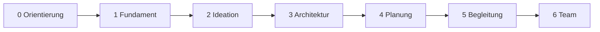

# Phasenplan

Arbeitsplan zum Folgen. Die [Roadmap](roadmap.md) und [Produktrichtung](product-direction.md) beschreiben die verfeinerte Ziel-Sicht (MVP M1–M4: Spec → Git → Board → Tracking). **Dieses Dokument** ist die **operative Reihenfolge der Arbeit**. Ein Arbeitspaket nach dem anderen. Code nur nach expliziter Freigabe (`code`, `execute`, `umsetzen`, `make it so`).

**Aktuell:** Phase 0, AP 1.1 und AP 1.2 sind erledigt. Als Nächstes **[#38 AP 1.2b — Fastify API (clean scaffold)](https://github.com/ktauchert/dev-companion/issues/38)** ([Plan](phases/phase1/ap-1.2b-fastify-scaffold.md)), danach **[#3 AP 1.3 — Datenbank](phases/phase1/ap-1.3-datenbank.md)**.

Nach Phase 1 Fundament folgen die MVP-Meilensteine aus der [Produktrichtung](product-direction.md#mvp-meilensteine-priorisiert). Neue Fähigkeiten (Board-Sync, PAT-Polling) ergänzen die Phasen 2–5 — sie ersetzen die bestehenden Arbeitspakete nicht ohne bewusste Umbuchung. Code-Hinweise: [architecture/HINWEIS.md](../architecture/HINWEIS.md).

Umsetzungspläne (was genau, was nötig ist): [planning/phases](phases/). Phase 1 ab 1.3: [phases/phase1](phases/phase1/).


```mermaid
flowchart LR
  P0["0 Orientierung"] --> P1["1 Fundament"]
  P1 --> P2["2 Ideation"]
  P2 --> P3["3 Architektur"]
  P3 --> P4["4 Planung"]
  P4 --> P5["5 Begleitung"]
  P5 --> P6["6 Team"]
```

```text
Orientierung → Fundament → Ideation → Architektur → Planung → Begleitung → Team
     done         next
```

Progress (Konsistenz anerkennen, kleine Beiträge zählen, kein Volumen-Score) ist **kein spätes Extra**. Es beginnt sichtbar im Dashboard (Phase 1) und wird mit jeder Phase reicher — nie als Streak-Druck.

---

## Phase 0 — Orientierung

**Status:** erledigt.

### Warum

Ohne Motivation, Linie und Docs wäre der erste Code wieder ein leeres Repo. Genau das soll Dev-Companion verhindern — zuerst bei uns selbst.

### Was

Produktname Dev-Companion, Motivation (Linie + Konsistenz), Companion-first, npm Workspaces, schlanke Doc-Struktur unter `docs/`, GitHub angebunden.

### Wie

Diskussion, dann Docs. Kein Produktcode.

### Arbeitspakete

| ID | Paket | Fertig wenn |
| --- | --- | --- |
| AP 0.1 | Motivation und Plan | `project-plan.md` trägt die echte Motivation |
| AP 0.2 | Doc-Struktur | Root nur README, AGENTS, CONTRIBUTING; Rest unter `docs/` |
| AP 0.3 | Arbeitsmodus Agent | Companion-first, Commit-Message-Konvention |
| AP 0.4 | Name und Stack-Entscheidungen | Dev-Companion, npm, ADRs 001/002/003 |

---

## Phase 1 — Fundament

**Status:** in Arbeit — AP 1.1 und 1.2 erledigt, **#38 Fastify clean scaffold** dann **#3 Datenbank** als Nächstes.

### Warum

Die Linie muss **betretbar** sein: einloggen, Projekt anlegen, Dashboard sehen, merken dass ein kleiner Schritt zählt. Ohne dieses Fundament sind Ideation und KI nur Chat ohne Ort.

### Was

Laufendes lokales System: Monorepo (Vite/TanStack Router + Fastify API — [ADR-004](../adr/ADR-004-FASTIFY-API.md)), Docker (PostgreSQL), Auth, Projekte mit Besitz, Dokumentenspeicher (noch ohne Wizard), Dashboard mit leichtem Progress-Hinweis. CI, das zumindest installiert und typecheckt.

### Wie

Zuerst Grenzen und Datenmodell in Docs schärfen, dann Arbeitspaketweise umsetzen. Auth und DB hinter Interfaces (ADR-002). Progress in Phase 1 nur: „du warst da / du hast etwas festgehalten“ — keine Punkte, keine Leaderboards.

### Arbeitspakete

| ID | Paket | Was | Wie | Fertig wenn |
| --- | --- | --- | --- | --- |
| AP 1.1 | Monorepo | `apps/web`, `apps/api`, `packages/*` als npm Workspaces | Scaffold passend zu `docs/architecture/monorepo.md` | `npm install` im Root, beide Apps starten leer aber gültig |
| AP 1.2 | Lokal-Infra | PostgreSQL per Docker Compose | Compose unter `infrastructure/` bzw. Root, wie in `docs/development.md`. Kein Redis, solange es keine Worker/Jobs gibt. | `docker compose up` reicht für lokale Postgres |
| AP 1.2b | Fastify API | Nest-Scaffold entfernen, Fastify neu (clean start) | [Umsetzungsplan](phases/phase1/ap-1.2b-fastify-scaffold.md) · ADR-004 | `GET /health` auf Port 3000, keine Nest-Deps |
| AP 1.3 | Datenbank | Drizzle-Schema, Migrationen, Zugriff in `packages/database` | [Umsetzungsplan](phases/phase1/ap-1.3-datenbank.md) | Migration läuft gegen Compose-Postgres |
| AP 1.4 | Auth | Registrierung, Login, Session, Projektbesitz | [Umsetzungsplan](phases/phase1/ap-1.4-auth.md) | Nutzer kann Konto anlegen und bleibt eingeloggt |
| AP 1.5 | Projekte | Anlegen, bearbeiten, besitzen, Status | [Umsetzungsplan](phases/phase1/ap-1.5-projekte.md) | Ein User hat mindestens ein eigenes Projekt |
| AP 1.6 | Dokumentenkern | Persistente, versionierbare Artefakte | [Umsetzungsplan](phases/phase1/ap-1.6-dokumentenkern.md) | Ein Dokument kann angelegt und versioniert werden |
| AP 1.7 | Dashboard | Projektübersicht, Status, erster Konsistenz-Hinweis | [Umsetzungsplan](phases/phase1/ap-1.7-dashboard.md) | Nach einer kleinen Änderung sieht der User Anerkennung, nicht eine Punktzahl |
| AP 1.8 | Qualität | Lint, Typecheck, erste Tests, GitHub Actions | [Umsetzungsplan](phases/phase1/ap-1.8-qualitaet.md) | CI läuft auf `main` |

**Nicht in Phase 1:** LLM-Aufrufe, Ideation-Wizard, Team, Deployment auf Render (lokal reicht).

---

## Phase 2 — Ideation

### Warum

Solo-Devs starten im Kopf. Der Wizard macht daraus die **erste dokumentierte Linie**: Problem, Nutzer, Nutzen, Ziele, Risiken, Grenzen. Ohne persistente Artefakte bleibt Ideation ein Gespräch.

### Was

Geführter Ideation-Flow pro Projekt. KI darf zusammenfassen, schärfen, Lücken zeigen — Vorschläge, keine Wahrheit. Ergebnis: versionierte Einstiegsdokumente.

### Wie

Wizard schreibt nur über die Documents-Domain. KI hinter `LLMProvider` (zuerst OpenAI). Jede KI-Ausgabe validieren, bevor sie persistiert wird. Fortschritt: auch ein gespeicherter Wizard-Schritt zählt.

### Arbeitspakete

| ID | Paket | Was | Fertig wenn |
| --- | --- | --- | --- |
| AP 2.1 | Wizard-Schritte | Problem, Zielgruppe, Value, Ziele, Risiken, Constraints | Nutzer kann den Flow durchlaufen und unterbrechen |
| AP 2.2 | Artefakte aus Ideation | Vision / Kurzprofil als versioniertes Dokument | Abschluss erzeugt persistente Docs, editierbar |
| AP 2.3 | KI-Provider | Interface + OpenAI-Adapter, strukturierte Antworten | Analyse läuft gegen das Interface, nicht gegen SDK-Calls in der Domain |
| AP 2.4 | KI-Hilfe Ideation | Summary, Scope, Reife, Empfehlungen | Vorschläge sichtbar; Übernehmen ist eine bewusste User-Aktion |
| AP 2.5 | Progress | Kleine Wizard-/Doc-Schritte anerkennen | Feedback ohne Mengen-Score |

---

## Phase 3 — Architektur

### Warum

Entscheidungen, die nur im Chat leben, sind beim nächsten Projekt weg. Architektur und ADRs sind die Linie für Stack, Schnittstellen und Kompromisse.

### Was

Pro Projekt: Stack-Vorschlag, grobe Architektur, Datenmodell-Skizze, Architektur-Dokument, ADRs mit Historie. KI darf entwerfen, der User entscheidet.

### Wie

Eigene Architecture-Domain; ADRs sind Dokumente mit Status (Proposed / Accepted / …). Nichts erzwingen — Default-Pfad anbieten. Bestehende Projekt-ADRs (001, 002) sind das Muster, nicht der Inhalt fremder Projekte.

### Arbeitspakete

| ID | Paket | Was | Fertig wenn |
| --- | --- | --- | --- |
| AP 3.1 | Stack-Empfehlung | Frontend, Backend, DB, Infra, Hosting als Vorschlag | Nutzer kann übernehmen, anpassen oder ablehnen |
| AP 3.2 | Architektur-Doku | Überblick, Komponenten, Datenmodell | Versioniertes Architektur-Artefakt existiert |
| AP 3.3 | ADRs | Anlegen, Status, Historie, optional KI-Entwurf | Entscheidung ist nachvollziehbar ohne den Chat |
| AP 3.4 | Progress | Anerkennung für festgehaltene Entscheidungen | Eine ADR zählt — unabhängig von Länge |

---

## Phase 4 — Planung

### Warum

Ohne Schnitt zwischen Vision und nächstem Schritt entsteht wieder Hero-Arbeit. Planung zerlegt die Linie in Pakete, die konsistent klein bleiben dürfen.

### Was

Backlog: Epics, Features, Stories, Tasks. Grobe Priorität (MVP / danach / später). Reihenfolge und Abhängigkeiten. Keine Scheingenauigkeit bei Schätzungen.

### Wie

Planning-Domain liest vorhandene Artefakte (Ideation, Architektur), schreibt Pläne als Dokumente. KI darf schneiden und sortieren; der User priorisiert.

### Arbeitspakete

| ID | Paket | Was | Fertig wenn |
| --- | --- | --- | --- |
| AP 4.1 | Backlog-Modell | Epics → Features → Stories → Tasks | Hierarchie ist persistent und am Projekt hängend |
| AP 4.2 | Priorisierung | MVP / Post-MVP / später | Nutzer kann umsortieren ohne Neu-Generierung |
| AP 4.3 | Reihenfolge | Abhängigkeiten, sinnvolle Umsetzungsreihenfolge | Nächstes Arbeitspaket ist sichtbar |
| AP 4.4 | Progress | Haken an kleinen Tasks ist Konsistenz, nicht Velocity | Keine Story-Points als Wertung der Person |

---

## Phase 5 — Begleitung in der Umsetzung

### Warum

Die Linie darf nach dem Plan nicht abreißen. In der Umsetzung braucht der Solo-Dev Erinnerung an Qualität, Tests, Bereitschaft — und weiter Anerkennung fürs Weitermachen.

### Was

Begleitung am aktuellen Task: Hinweise zu Tests, Review, Checklisten, Deployment-Bereitschaft, sichtbare technische Schulden. Deployment-Domain: Checklisten und Pläne, noch nicht zwingend ein Klick-Deploy.

### Wie

Lesen aus Backlog + Docs; schreiben von Checklisten und Schuld-Notizen als Artefakte. KI assistiert am Diff oder am Task, ersetzt kein Review. Render o. Ä. erst, wenn lokal und CI stehen.

### Arbeitspakete

| ID | Paket | Was | Fertig wenn |
| --- | --- | --- | --- |
| AP 5.1 | Task-Begleitung | Guidance, Testvorschläge, PR-/Done-Checkliste | Am offenen Task ist der nächste Qualitäts-Schritt klar |
| AP 5.2 | Schulden | Festhalten und Wiederfinden technischer Schulden | Schulden sind Artefakte, nicht nur Bauchgefühl |
| AP 5.3 | Deployment-Bereitschaft | Checklisten, Hosting-Empfehlung, Plan | Vor dem ersten echten Deploy gibt es eine Liste, kein Rätsel |
| AP 5.4 | Progress | Auch Tests, Docs, kleine Fixes zählen | Umsetzung misst nicht nur „Feature fertig“ |

---

## Phase 6 — Team

### Warum

Zweitnutzer und kleine Teams brauchen dieselbe Linie, geteilt — ohne aus dem Solo-Produkt ein Enterprise-IAM zu machen. Später, wenn Phase 1–5 für eine Person stimmen.

### Was

Geteilte Projekte, Rollen grob, Kommentare an Artefakten, gemeinsames Folgen der Linie. Progress bleibt individuell ermutigend, kein Vergleich zwischen Personen.

### Wie

Nur bauen, was ein zweiter Mensch wirklich braucht. Keine vorauseilende Multi-Tenant-Orgie.

### Arbeitspakete

| ID | Paket | Was | Fertig wenn |
| --- | --- | --- | --- |
| AP 6.1 | Teilen | Zweiten Nutzer an ein Projekt holen | Beide sehen dieselben Artefakte |
| AP 6.2 | Rollen | Mindestens Besitzer / Mitglied | Kein stilles Überschreiben kritischer Entscheidungen ohne Klarheit |
| AP 6.3 | Kommentare | Diskussion am Dokument, nicht nur im Chat | Entscheidung landet wieder im Artefakt |
| AP 6.4 | Progress | Keine Bestenlisten | Konsistenz bleibt persönlich, nicht kompetitiv |

---

## GitHub (Issues / Milestones)

Backlog an [Produktrichtung](product-direction.md) und [github-backlog-migration.md](github-backlog-migration.md) ausgerichtet. Ein Arbeitspaket = ein Issue = ein Branch = ein PR.

| GitLab | GitHub | Bei uns |
| --- | --- | --- |
| Milestone | **Milestone** | MVP-Meilenstein oder Phase 1 Fundament |
| Issue | **Issue** | ein Arbeitspaket |
| Merge Request | **Pull Request** | Branch der Issue → `main` |

### Milestones

| Milestone | Fokus | Issues |
| --- | --- | --- |
| [Phase 1 — Fundament](https://github.com/ktauchert/dev-companion/milestone/1) | Monorepo, Docker, Auth, Projekte, Docs, Dashboard, CI | #1–#2 ✓, **#38**, #3–#8 |
| [Foundation — Datenmodell & Provider](https://github.com/ktauchert/dev-companion/milestone/7) | Core Types, GitProviderAdapter | #39–#40 |
| [M1 — Ideation & Spec](https://github.com/ktauchert/dev-companion/milestone/2) | Interview → spec.md → ADRs | #11, #9–#10, #12, #15–#16 |
| [M2 — Git Push](https://github.com/ktauchert/dev-companion/milestone/8) | PAT → Repo, Artefakte pushen | #41 |
| [M3 — Board Seeding](https://github.com/ktauchert/dev-companion/milestone/4) | Breakdown, Sync, Dry-Run | #18, #42–#44 |
| [M4 — SDLC Tracking](https://github.com/ktauchert/dev-companion/milestone/5) | Polling, Dashboard, Compliance, Deploy-Guide | #45–#47, #24 |
| [Phase 4 — Production](https://github.com/ktauchert/dev-companion/milestone/6) | GitHub App, Stripe, On-Prem, lokale KI | #26–#28, #48–#51 |

Geschlossen: Milestone „Phase 3 — Architektur“ (Issues nach M1 umgebucht). Label `later`: [#23](https://github.com/ktauchert/dev-companion/issues/23).

### Issues (offen)

| Issue | Titel | Milestone | Branch |
| --- | --- | --- | --- |
| [#38](https://github.com/ktauchert/dev-companion/issues/38) | AP 1.2b — Fastify API (clean scaffold) | Phase 1 — Fundament | `ap-1-2b-fastify-scaffold` |
| [#3](https://github.com/ktauchert/dev-companion/issues/3) | AP 1.3 — Datenbank | Phase 1 — Fundament | `ap-1-3-datenbank` |
| [#4](https://github.com/ktauchert/dev-companion/issues/4) | AP 1.4 — Auth | Phase 1 — Fundament | `ap-1-4-auth` |
| [#5](https://github.com/ktauchert/dev-companion/issues/5) | AP 1.5 — Projekte | Phase 1 — Fundament | `ap-1-5-projekte` |
| [#6](https://github.com/ktauchert/dev-companion/issues/6) | AP 1.6 — Dokumentenkern | Phase 1 — Fundament | `ap-1-6-dokumentenkern` |
| [#7](https://github.com/ktauchert/dev-companion/issues/7) | AP 1.7 — Dashboard | Phase 1 — Fundament | `ap-1-7-dashboard` |
| [#8](https://github.com/ktauchert/dev-companion/issues/8) | AP 1.8 — Qualität | Phase 1 — Fundament | `ap-1-8-qualitaet` |
| [#39](https://github.com/ktauchert/dev-companion/issues/39) | F0.1 — Core Types | Foundation | — |
| [#40](https://github.com/ktauchert/dev-companion/issues/40) | F0.2 — GitProviderAdapter | Foundation | — |
| [#11](https://github.com/ktauchert/dev-companion/issues/11) | M1.0 — LLMProvider | M1 — Ideation & Spec | `ap-2-3-ki-provider` |
| [#9](https://github.com/ktauchert/dev-companion/issues/9) | M1.1 — KI-Interview / Wizard | M1 | `ap-2-1-wizard-schritte` |
| [#10](https://github.com/ktauchert/dev-companion/issues/10) | M1.2 — spec.md Generierung | M1 | `ap-2-2-ideation-artefakte` |
| [#12](https://github.com/ktauchert/dev-companion/issues/12) | M1.3 — KI-Hilfe im Interview | M1 | `ap-2-4-ki-hilfe-ideation` |
| [#15](https://github.com/ktauchert/dev-companion/issues/15) | M1.4 — Architektur-Doku aus Spec | M1 | `ap-3-2-architektur-doku` |
| [#16](https://github.com/ktauchert/dev-companion/issues/16) | M1.5 — ADR Engine | M1 | `ap-3-3-adrs` |
| [#41](https://github.com/ktauchert/dev-companion/issues/41) | M2.1 — GitHub PAT Push | M2 — Git Push | — |
| [#18](https://github.com/ktauchert/dev-companion/issues/18) | M3.1 — Internes Backlog / Dry-Run Modell | M3 — Board Seeding | `ap-4-1-backlog-modell` |
| [#42](https://github.com/ktauchert/dev-companion/issues/42) | M3.2 — Task Breakdown Engine | M3 | — |
| [#43](https://github.com/ktauchert/dev-companion/issues/43) | M3.3 — GitHub Board Sync | M3 | — |
| [#44](https://github.com/ktauchert/dev-companion/issues/44) | M3.4 — Board Dry-Run | M3 | — |
| [#45](https://github.com/ktauchert/dev-companion/issues/45) | M4.1 — PAT-Polling | M4 — SDLC Tracking | — |
| [#46](https://github.com/ktauchert/dev-companion/issues/46) | M4.2 — SDLC Dashboard (extern) | M4 | — |
| [#47](https://github.com/ktauchert/dev-companion/issues/47) | M4.3 — ADR-Compliance-Check | M4 | — |
| [#24](https://github.com/ktauchert/dev-companion/issues/24) | M4.4 — Deployment-Guide Generator | M4 | `ap-5-3-deployment-bereitschaft` |
| [#26](https://github.com/ktauchert/dev-companion/issues/26) | P4.1 — Projekt teilen | Phase 4 — Production | `ap-6-1-teilen` |
| [#27](https://github.com/ktauchert/dev-companion/issues/27) | P4.2 — Rollen | Phase 4 | `ap-6-2-rollen` |
| [#28](https://github.com/ktauchert/dev-companion/issues/28) | P4.3 — Kommentare an Artefakten | Phase 4 | `ap-6-3-kommentare` |
| [#48](https://github.com/ktauchert/dev-companion/issues/48) | P4.4 — GitHub App + Webhooks | Phase 4 | — |
| [#49](https://github.com/ktauchert/dev-companion/issues/49) | P4.5 — Stripe Billing | Phase 4 | — |
| [#50](https://github.com/ktauchert/dev-companion/issues/50) | P4.6 — On-Prem Docker/Helm | Phase 4 | — |
| [#51](https://github.com/ktauchert/dev-companion/issues/51) | P4.7 — Ollama / LM Studio | Phase 4 | — |
| [#23](https://github.com/ktauchert/dev-companion/issues/23) | AP 5.2 — Schulden (`later`) | — | `ap-5-2-schulden` |

Geschlossene Issues #1–#2, #13–#14, #17, #19–#22, #25, #29 (Label `superseded`). Details: [github-backlog-migration.md](github-backlog-migration.md).

### Ablauf am nächsten Ticket

```text
[#38 AP 1.2b — Fastify API (clean scaffold)](https://github.com/ktauchert/dev-companion/issues/38)
  → Create a branch  (ap-1-2b-fastify-scaffold)
  → umsetzen
  → Pull Request → main
  → mergen, Issue schließen
  → [#3 AP 1.3 — Datenbank](https://github.com/ktauchert/dev-companion/issues/3)
```

## So folgen

1. Nur das aktuelle Arbeitspaket: **[#38 AP 1.2b — Fastify API (clean scaffold)](https://github.com/ktauchert/dev-companion/issues/38)** ([Plan](phases/phase1/ap-1.2b-fastify-scaffold.md)), danach **[#3 AP 1.3 — Datenbank](https://github.com/ktauchert/dev-companion/issues/3)**.
2. Zuerst in Docs klären, wenn etwas fehlt (Modell, Grenze, ADR).
3. Dann bewusst umsetzen lassen — idealerweise auf dem Branch der zugehörigen Issue.
4. Fertig-wenn prüfen, PR mergen, Issue schließen, dann das nächste Paket.
5. Phasen nicht überspringen, nur weil KI den Wizard schon „könnte“. Ohne Fundament (Auth, Projekt, Dokument) gibt es keine Linie zum Speichern.

Abweichungen (Paket vorziehen, streichen) kurz hier oder in der Roadmap notieren — nicht nur im Chat.
