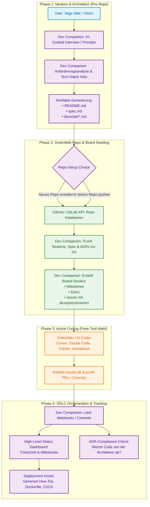

# User Journey

End-to-end-Ablauf von der vagen Idee bis zum getrackten SDLC. Entspricht der verfeinerten [Produktrichtung](product-direction.md).

## Lesart

1. **Pre-Repo** — Alles passiert in Dev-Companion; noch kein externes Git nötig (M1).
2. **Greenfield** — Repo wird angelegt oder befüllt; Board wird geseedet (M2, M3).
3. **Active Coding** — Dev-Companion tritt zurück; der Nutzer wählt sein Coding-Tool frei.
4. **Orchestration** — Dev-Companion liest Status (PAT-Polling im MVP, Webhooks in Phase 4), prüft ADR-Compliance, hilft beim Deploy (M4+).

## MVP vs. später

| Schritt | MVP | Später (Phase 4) |
| --- | --- | --- |
| Git-Anbindung | PAT + Polling | GitHub App + Webhooks |
| KI | OpenAI | + Ollama/LM Studio On-Prem |
| Billing | — | Stripe (Team, Pro-Prompts) |
| Board-Vorschau | Dry-Run vor Push | — |
